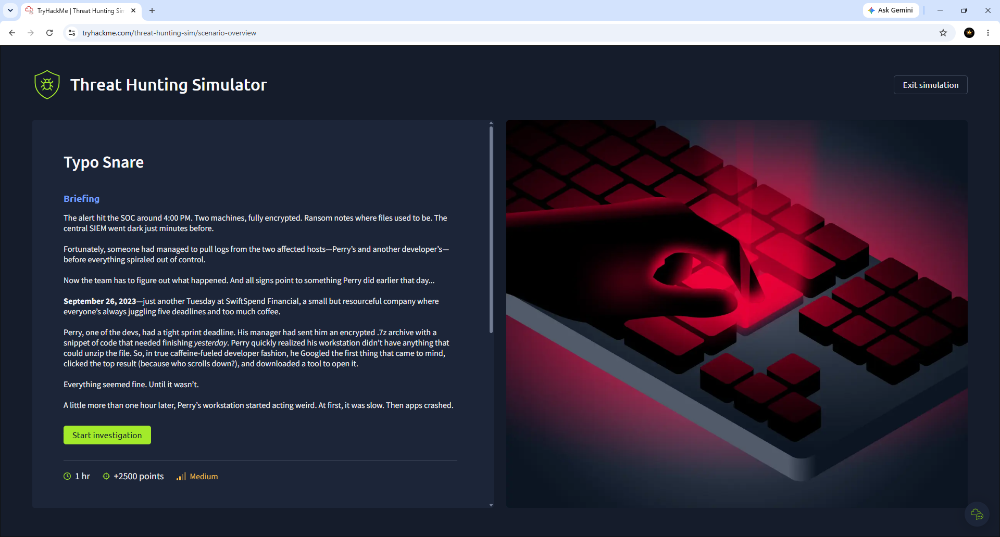
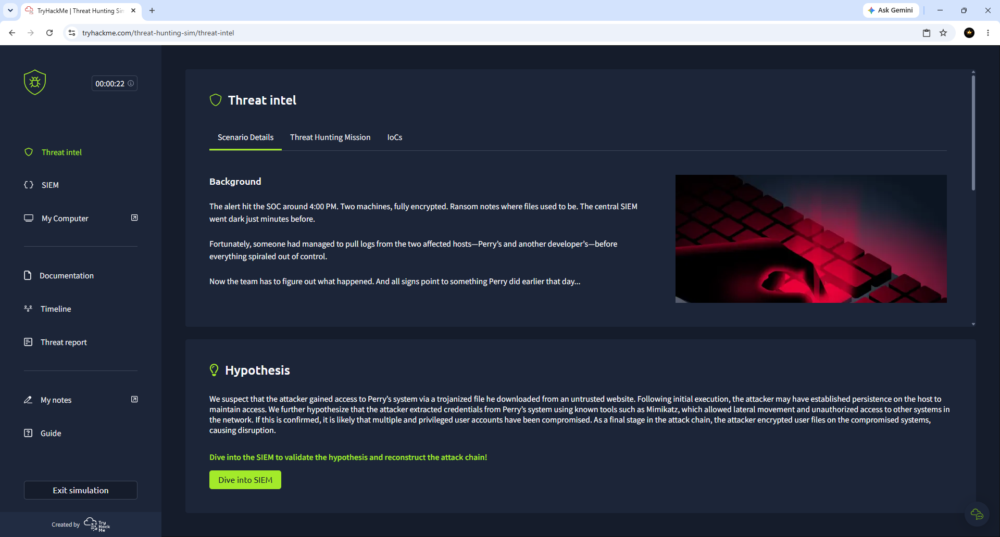
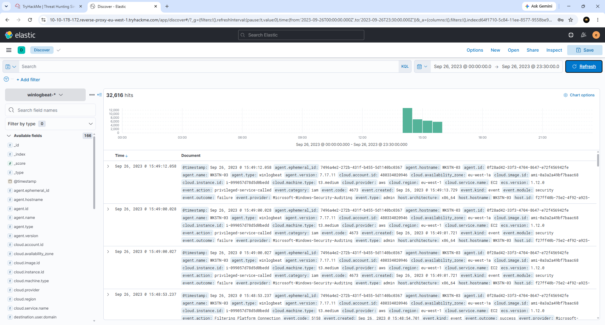
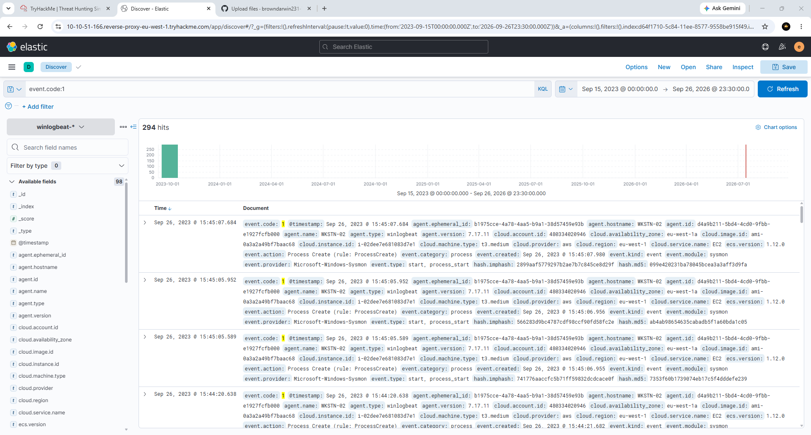
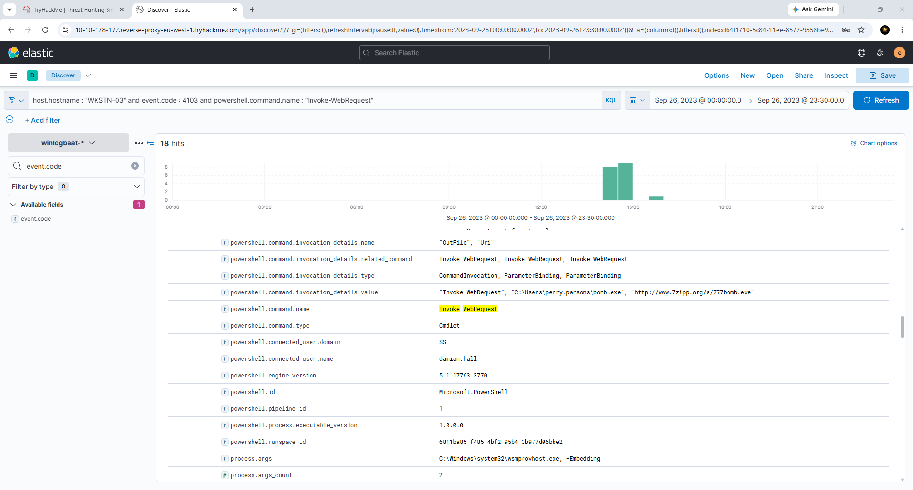

# Darwin-TryHackMe-Threat-Hunting-Simulator-Lab
Hands-on TryHackMe Threat Hunting Simulator investigation using Elastic SIEM to analyze malicious PowerShell activity, malware execution, credential dumping, attacker reconnaissance, and Windows Sysmon logs while documenting the attack chain with MITRE ATT&amp;CK techniques.
---

## Objectives

- Investigate suspicious Windows events
- Analyze Sysmon Process Creation events
- Identify malicious PowerShell activity
- Track malware execution
- Detect credential dumping
- Investigate attacker reconnaissance
- Build an attack timeline
- Document findings using MITRE ATT&CK

---

## Tools Used

- TryHackMe Threat Hunting Simulator
- Elastic SIEM (Discover)
- Elastic Query Language (KQL)
- Windows Sysmon
- MITRE ATT&CK Framework

---

## Skills Demonstrated

- Threat Hunting
- SIEM Investigation
- KQL Searching
- Process Analysis
- IOC Identification
- Windows Event Log Analysis
- Malware Investigation
- Credential Dumping Detection
- Attack Timeline Reconstruction
- MITRE ATT&CK Mapping

---

## Attack Summary

### Stage 1 – Initial Access

The attacker downloaded a malicious executable using a PowerShell command from an external website.

**MITRE ATT&CK**
- T1189 – Drive-by Compromise

---

### Stage 2 – Malware Execution

The downloaded malware (`bomb.exe`) was executed, allowing the attacker to gain code execution on the compromised workstation.

**MITRE ATT&CK**
- T1204 – User Execution

---

### Stage 3 – Credential Dumping

The attacker executed **Mimikatz** to dump credentials from LSASS and obtain user password hashes.

**MITRE ATT&CK**
- T1003 – OS Credential Dumping

---

### Stage 4 – Network Discovery

The attacker executed Windows command-line tools to enumerate users, groups, shares, and network information.

**MITRE ATT&CK**
- T1016 – System Network Configuration Discovery

---

## Indicators of Compromise (IOCs)

### Host Indicators

- bomb.exe
- mimikatz.exe
- net.exe
- powershell.exe

### Network Indicators

- www.7zipp.org

---

## MITRE ATT&CK Techniques

| Technique | ID |
|-----------|----|
| Drive-by Compromise | T1189 |
| User Execution | T1204 |
| OS Credential Dumping | T1003 |
| System Network Configuration Discovery | T1016 |

---

## Screenshots

### 1. Threat Hunting Simulator Briefing

---

### 2. Threat Intelligence Dashboard

---

### 3. Elastic Discover Overview

---

### 4. Process Creation Events

---

### 5. Malicious Download Detected

---

## What I Learned

- Investigated attacker behavior using Elastic SIEM.
- Queried Windows Sysmon events with KQL.
- Identified malicious PowerShell activity.
- Traced malware execution through process creation events.
- Detected credential dumping with Mimikatz.
- Investigated attacker reconnaissance using Windows utilities.
- Mapped attacker actions to the MITRE ATT&CK Framework.
- Documented the attack lifecycle in a structured incident timeline.

---

## Author

**Darwin Brown**
Aspiring SOC Tier 1
