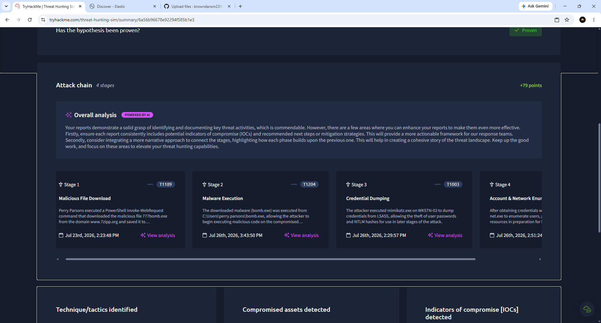

# Darwin-TryHackMe-Threat-Hunting-Simulator-Lab

Hands-on TryHackMe Threat Hunting Simulator investigation using Elastic SIEM to analyze malicious PowerShell activity, malware execution, credential dumping, attacker reconnaissance, and Windows Sysmon logs while documenting the attack chain with MITRE ATT&amp;CK techniques.
---

## 🎯 Objectives

- Perform a threat hunting investigation
- Analyze logs using Elastic Discover
- Identify malicious process creation events
- Investigate malware execution
- Detect credential dumping activity
- Document attacker behavior
- Build an attack timeline
- Map activity to the MITRE ATT&CK framework

---

## 🛠️ Technologies Used

- TryHackMe
- Elastic SIEM
- Elastic Discover
- Windows Sysmon
- Windows Event Logs
- MITRE ATT&CK
- Threat Hunting Methodology

---

## 🔍 Skills Demonstrated

- Threat Hunting
- SIEM Investigation
- Process Analysis
- Malware Detection
- Windows Event Log Analysis
- Attack Chain Reconstruction
- MITRE ATT&CK Mapping
- Incident Documentation

---

## 📸 Screenshots

### 01 – Typo Snare Briefing
Initial investigation briefing describing the suspected attack and objectives.

---

### 02 – Threat Intelligence Dashboard
Threat intelligence information used to investigate attacker infrastructure and indicators.

---

### 03 – Elastic Discover Overview
Elastic Discover interface used to investigate Windows event logs and telemetry.

---

### 04 – Process Creation Events
Sysmon Process Create (Event ID 1) logs showing process creation activity during the investigation.

---

### 05 – Malicious Download Detected
Evidence of malicious activity identified during the investigation, including suspicious executable execution.

---

### 06 – Attack Chain Summary
Final reconstructed attack chain documenting each stage of the intrusion and mapping activity to MITRE ATT&CK techniques.

---

## 📈 Investigation Summary

During this investigation I:

- Investigated Windows telemetry in Elastic SIEM
- Reviewed Sysmon process creation events
- Identified suspicious malware execution
- Investigated credential dumping activity
- Documented attacker discovery techniques
- Reconstructed the attack timeline
- Produced a complete incident report

---

## 📚 MITRE ATT&CK Techniques

- T1189 – Drive-by Compromise
- T1204 – User Execution
- T1003 – OS Credential Dumping
- T1016 – System Network Configuration Discovery

---

## 📌 Key Takeaways

This project demonstrates practical SOC analyst skills by combining threat intelligence, log analysis, process investigation, attack chain reconstruction, and incident reporting in a realistic threat hunting scenario using Elastic SIEM.

---

## Author

**Darwin Brown**
Aspiring SOC Tier 1
